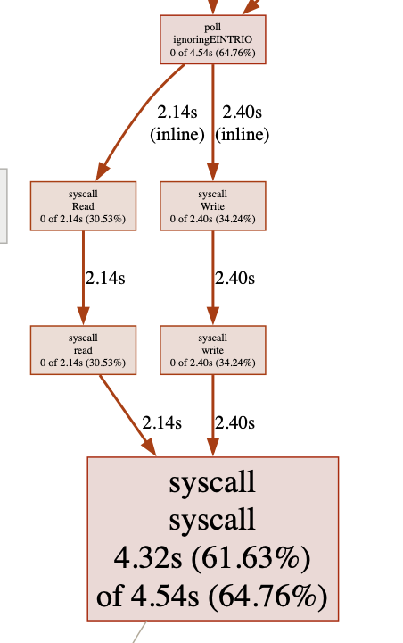

# MemTable
MemTable 是一个仿照 redis 架构写成的基于内存的键值对存储服务，支持 RESP 通信协议，支持标准 redis-cli，并提供了持久化机制和主从复制机制用于故障容错。

## Features

- 支持 redis 客户端和 RESP 通信协议
- 支持 redis pipeline 通信
- 支持 String,List,Set,ZSet,Hash,Bitmap 等多种数据结构
- 支持 pub/sub，基于前缀树实现路径递归发布
- 支持 TTL 功能，可以设置键值对过期
- 支持 AOF、RDB 持久化
- 支持主从复制

## Usage

```shell
# build
go build -o memtable main.go

# run
./memtable default.conf
```

## Support Commands

MemTable 数据库部分目前支持以下命令：

|    key    |  string  |  list  |     set     |    hash    |       zset       |  bitmap  |  other   |
| :-------: | :------: | :----: | :---------: | :--------: | :--------------: | :------: | :------: |
|    del    |   set    |  llen  |    sadd     |    hset    |       zadd       |  setbit  |  select  |
|  exists   |   get    | lpush  |    scard    |    hget    |      zcount      |  getbit  | flushdb  |
|   keys    |  getset  |  lpop  |  sismember  |  hexists   |      zcard       | bitcount | flushall |
|    ttl    | getrange | rpush  |    srem     |    hdel    |       zrem       |  bitpos  |  dbsize  |
|  expire   | setrange |  rpop  |    spop     |   hmset    |     zincrby      |          |          |
|  rename   |   mget   | lindex | srandmember |   hmget    |      zscore      |          |          |
|   type    |   incr   |  lpos  |    smove    |  hgetall   |      zrank       |          |          |
| randomkey |  incrby  |  lset  |    sdiff    |   hkeys    |     zrevrank     |          |          |
|           |   decr   |  lrem  | sdiffstore  |   hvals    |      zrange      |          |          |
|           |  decrby  | lrange |   sinter    |  hincrby   |    zrevrange     |          |          |
|           |  append  | ltrim  | sinterstore |    hlen    |  zrangebyscore   |          |          |
|           |          | lmove  |   sunion    |  hstrlen   | zrevrangebysocre |          |          |
|           |          |        | sunionstore | hrandfield | zremrangebyscore |          |          |
|           |          |        |             |            | zremrangebyrank  |          |          |

MemTable 其他部分目前支持以下命令：

|   tx    |   pubsub    | replication |  other   |
| :-----: | :---------: | :---------: | :------: |
|  multi  |   publish   |    sync     |   ping   |
|  exec   |  subscribe  |    psync    |   quit   |
| discard | unsubscirbe |  replconf   | shutdown |
|         |             |   slaveof   |   save   |
|         |             |             |  bgsave  |

## Architecture

MemTable 基于单事件循环与多 IO 循环模型，Accept Loop 接受客户端连接后，开启新协程运行 IO Loop 解析命令，命令解析完毕后通知 EventLoop 执行命令，最终由 IO Loop 负责写回数据。

```go
func EventLoop() {

  for !quit{
    
		select {
      
		case <-timer.C:

			// 执行时间事件
      execTimeEvent()

		case cli := <-events:
			
      // 执行 IO 时间
      eventRes := executeIOEvent(cli.event)
      
      // 通知阻塞的客户端
			cli.res <- eventRes

		}
	}
  // 执行退出事件
  executeShutdownEvents()
}
```

## benchmark

基准测试使用标准 redis-benchmark 工具，测试环境为 MacOS Ventura，8 GB RAM，双核四线程处理器。测试对比了 redis-server，MemTable，以及 github 上高评分的类似项目。测试结果如下：

```shell
# redis-server 
Summary:
  throughput summary: 76982.29 requests per second
  latency summary (msec):
          avg       min       p50       p95       p99       max
        0.387     0.152     0.351     0.655     0.799     1.511

# github.com/tangrc99/MemTable
Summary:
  throughput summary: 46289.86 requests per second
  latency summary (msec):
          avg       min       p50       p95       p99       max
        0.611     0.048     0.551     0.919     1.999     3.711
        
# github.com/HDT3213/godis
Summary:     
  throughput summary: 46680.32 requests per second
  latency summary (msec):
          avg       min       p50       p95       p99       max
        0.620     0.048     0.599     0.863     1.279     4.871

# github.com/alicebob/miniredis
Summary:
  throughput summary: 48426.15 requests per second
  latency summary (msec):
          avg       min       p50       p95       p99       max
        0.582     0.040     0.487     1.087     1.647     4.303
```

可以看到使用 go net 网络写成的 redis 服务吞吐量差别不大，使用 pprof 工具生成调用图，可以看到 net 网络库中的 IO 占据了 CPU 的绝大多数时间片。



将 MemTable 中的网络部分，更换为 gnet 网络库，在相同条件下测试，得到结果：

```shell
# 使用 gnet 网络库
Summary:
  throughput summary: 67977.26 requests per second
  latency summary (msec):
          avg       min       p50       p95       p99       max
        0.590     0.120     0.543     1.079     1.439     2.335
```

## TODO

- [ ] 将网络库替换为 gnet