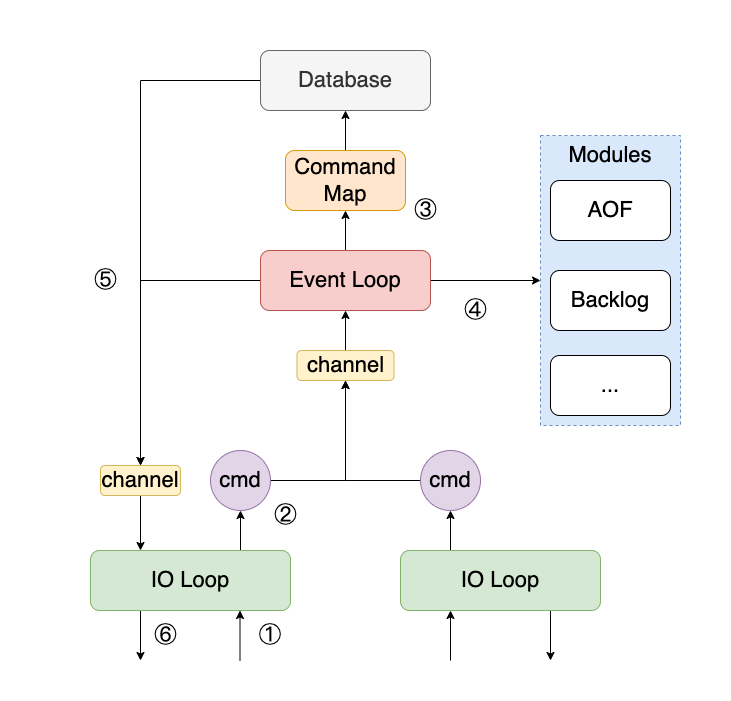
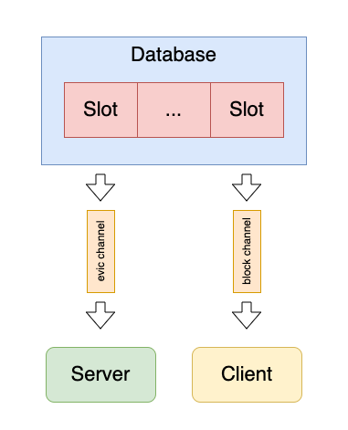

# Design

MemTable 主要可以划分为以下几个模块：

- **client**：交互式客户端；
- **config**：配置文件的解析与监控；
- **db**：内存数据库以及各种数据结构的定义，数据库命令的实现；
- **logger**：日志组件的相关代码；
- **resp**：定义各种 resp 格式消息的数据结构、提供解析和生成 resp 消息的各种函数；
- **server**：服务器的各项核心功能；
- **utils**：项目中会用到的一些独立功能。

## Structure

MemTable 处理一次客户端命令的大致流程如下：



其中：

1. IO Loop 接收并解析客户端的 RESP 请求报文，生成 Plain Text 格式的 cmd 消息；
2. 多个 IO Loop 共用一个发送端，通过 channel 将 cmd 发送给 Event Loop；
3. Event Loop 经过检查后，查询命令表，调用命令在数据库中执行；
4. 根据执行的命令类型以及执行结果，调用相关 Module；
5. 数据库/Event Loop 将执行结果通过 channel 异步发送给相关的 IO Loop；
6. IO Loop 将结果写回 Socket 中。

## Database

### Shard

内存数据库键值对存储部分是`Dict`数据结构，`Dict`是一个哈希表的切片：

```go
// Shard 是 Dict 中的一个分片
type Shard = map[string]Object

// Dict 包含了不同的分片，每一个分片包含一个哈希表
type Dict struct {
	shards []Shard // 存储键值对
	size   int     // table 分区数量
	count  int     // 键值对数量
	cost   int64   // 消耗的内存
}
```

使用`[]Shard`能够更好地管理键空间，一个 K-V 在`Dict`中的存储位置是根据 crc16 算法计算出来的，这与 Redis Cluster 中的 Slot 计算方法相同。因此，每一个`Shard`对应 Cluster 中的一个`Slot`，当 Cluster 需要动态扩充的时候，能够更加方便地进行键值对的迁移。

### Notification

在设计上，`Server`并不直接与`Database`进行交互，但内存数据库中会由于过期删除、键值对驱逐等原因删除一些键值对；当开启 AOF 持久化、主从复制时，这些变更必须要通知`Server`来完成相应的动作。另一方面，由于`pub/sub`、`brpop`等阻塞命令的存在，数据库的某些变更也必须通知已经阻塞的客户端。这里采取 channel 的方式进行通知。



这种实现方式很大程度上是由于`Server`与`Database`之间做了一些隔离，当客户端请求对内存数据库进行操作时，`Server`结构体并不能直接收到内存数据库中的变更，这种隔离的目的是为了简化具体命令对内存数据库的操作。


## Improvement

`MemTable`在设计上有许多不足之处，如果你想要写一个类似的项目，以下几点是你可以改进的：

- 使用 mmap 分配内存，使用 uintptr 代替指针，规避 Golang GC 问题；
- 使用第三方网络库，而非 net 网络库，减少 goroutine 调度延迟；
- 在数据库模块中，减少接口的使用，牺牲一定扩展性，防止接口转换造成性能下降；
- 数据库模块的隔离性问题，需要保证 Server 与 Database 的交互。

以上问题的详细探讨可以参考博客文章[Go 仿写 Redis 的一些思考](https://tangrc99.com/2023/04/06/Go-仿写-Redis-的一些思考/)。

