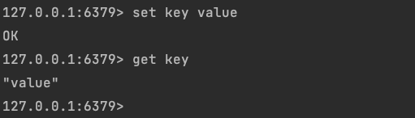
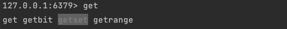
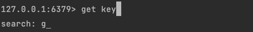
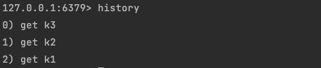

# Client

`memtable-cli`是一个交互式的 Redis 客户端，支持命令补全和历史搜索功能。用户可以在终端输入命令，按下`[ENTER]`后，客户端会将命令发送给连接的实例，并将返回的结果打印在终端上。

## Completion

在输入一部分字符后，按下`[TAB]`可以进入命令补全模式，命令补全器会根据当前输入的单词显示待补全选项。阴影标识的单词为当前的选中项，在命令补全模式在，按下`[TAB]`,`[LEFT]`,`[RIGHT]`可以切换选中项。如果待选项过多，会以分页的形式显示，按下`[UP]`,`[DOWN]`可以切换显示的待选项页。当待选项切换完毕时，屏幕会闪烁提醒用户。

在命令补全模式中，按下`[ENTER]`将选中的命令自动填充；按下`[ESC]+[ESC]`可以退出命令补全模式。

## History

在正常模式下，按下`[UP]`,`[DOWN]`可以选择历史命令填充，也可以按下组合键`[CONTROL]+[R]`进入历史命令搜索模式。如果当前有输入，输入的字符串会被复制到搜索字段中。

进入历史搜索模式后，用户只能够编辑搜索字段，上方会显示历史命令的搜索结果。在历史搜索模式中，再次按下`[CONTROL]+[R]`可以切换搜索结果，按下`[ENTER]`,`[LEFT]`,`[RIGHT]`键，可以退出历史命令搜索模式。

也可以通过输入`history`命令，查询当前缓存的历史命令；或者输入`history clean`来清理已经缓存的历史命令。

## Quit

在正常模式下，输入`quit`或使用组合键`[CONTROL]+[C]`可以退出客户端。